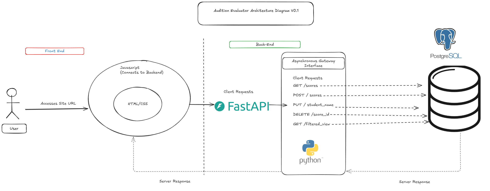
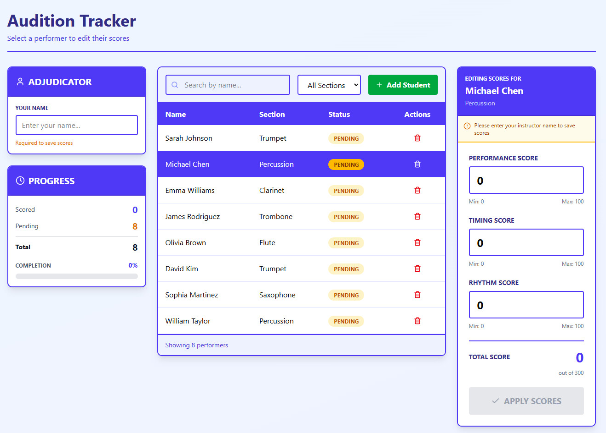

# Audition Evaluator Full Stack Site

Concept Description from my project description MD:

The Audition Tracker Evaluator Site is a web-based application designed to modernize and streamline the audition and adjudication process for performing arts programs specifically marching band–related activities. While performer skill levels have continued to rise, the tools used by adjudicators have largely remained inefficient and outdated (e.g., spreadsheets and manual data entry).

This project aims to replace those workflows with a focused, easy-to-use platform that allows instructors and adjudicators to quickly view, edit, and track performer information and scores in real time.

I am going to be building this project using a full-stack approach with an appropriate data layer captured on a site made with HTML/CSS and Javascript, APIs captured with a backend server managed in Python, and a lightweight database for the data storage layer written in PostgreSQL. The current diagram for this project is linked below. 

## Architecture Diagram v01

The first architectural diagram of the site that will continue to be modified.

  

## Wireframe Version v01 

First simple concept wireframe of the site that showcases exactly what we are intending for instructors, I will continue to add pages relating to database views as a whole.

  

## User Stories

The following user stories describe how the Audition Evaluator application is intended to be used by adjudicators and instructors.

1. **As an adjudicator**, I want to view a list of all registered performers so I can quickly identify who I am evaluating.
2. **As an adjudicator**, I want to search and filter performers by name, section, and age so I can locate the correct performer efficiently.
3. **As an adjudicator**, I want to view a performer’s detailed profile and scores so I can make informed evaluation decisions.
4. **As an adjudicator**, I want to submit or update performance scores so my evaluations are recorded accurately in real time.
5. **As an instructor or administrator**, I want to add late-registered performers so all audition participants are accounted for.

---

## Use Cases

The following use cases describe the primary interactions between users and the Audition Evaluator system. All actions are performed through FastAPI-backed API endpoints.

---

### UC-01: View Performer Roster

**Primary Actor:** Adjudicator / Instructor  
**Goal:** View all registered performers  

**Flow:**  
1. User opens the application.  
2. System sends a `GET /performers` request to the FastAPI backend.  
3. Backend retrieves performer records from PostgreSQL.  
4. System displays the performer list in the UI.  

**Result:**  
- All registered performers are visible to the user.

---

### UC-02: Filter and Search Performers

**Primary Actor:** Adjudicator / Instructor  
**Goal:** Locate specific performers quickly  

**Flow:**  
1. User enters filter criteria (name, section, age).  
2. System sends `GET /performers?name=&section=&age=` to FastAPI.  
3. Backend applies query filters and returns matching performers.  
4. UI updates with filtered results.  

**Result:**  
- Only performers matching the criteria are displayed.

---

### UC-03: Update or Delete Performer Records

**Primary Actor:** Instructor / Administrator  
**Goal:** Maintain accurate performer records  

**Flow:**  
1. User selects a performer from the roster.  
2. To update:  
   - System sends `PUT /performers/{performer_id}` with updated data.  
3. To delete:  
   - System sends `DELETE /performers/{performer_id}`.  
4. FastAPI validates the request and updates PostgreSQL.  
5. UI refreshes the performer list.  

**Result:**  
- Performer records are updated or removed from the system.

---

### UC-04: Create or Update Performer Scores

**Primary Actor:** Adjudicator  
**Goal:** Record audition evaluations  

**Flow:**  
1. User enters performance, timing, and rhythm scores.  
2. System sends `POST /scores` (new) or `PUT /scores/{score_id}` (update).  
3. FastAPI validates input and stores the scores in PostgreSQL.  
4. UI confirms successful submission.  

**Result:**  
- Performer scores are saved and associated with the correct performer.

---

### UC-05: Add a Late-Registered Performer

**Primary Actor:** Instructor / Administrator  
**Goal:** Register a performer after initial setup  

**Flow:**  
1. User opens the “Add Performer” form.  
2. User submits performer information.  
3. System sends `POST /performers` to FastAPI.  
4. Backend inserts the new performer into PostgreSQL.  
5. UI updates the roster.  

**Result:**  
- New performer is added and available for evaluation.

---

## Use-Case Diagram UML v01

Version 1 of the UML Use Case Diagram that reflects the use cases mentioned from the perspective actors of Adjudicator and Administrator. 
This will continue to be modified as the project progresses. 

  

